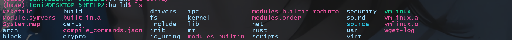
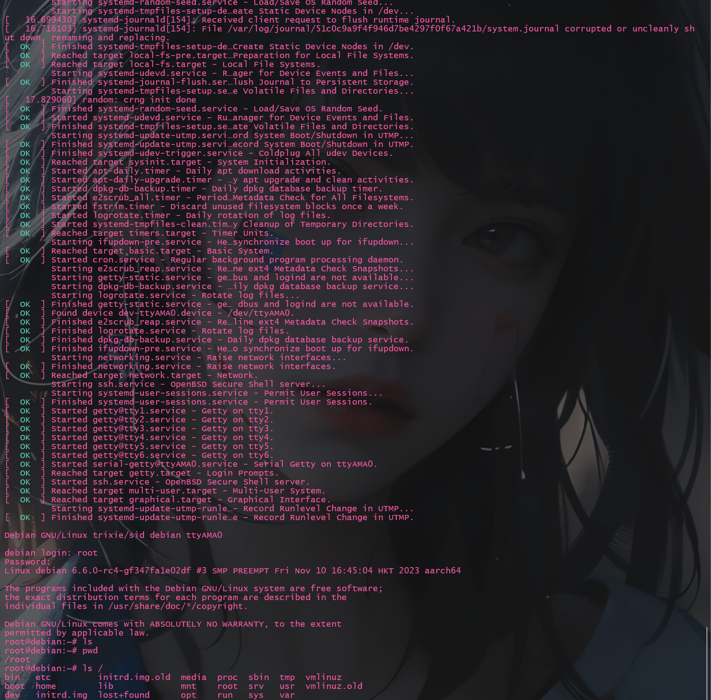

[第一次练习文档](../exercise1.md)
# 1 编译内核
1. 克隆仓库
```bash
$ git clone https://github.com/Rust-for-Linux/linux -b rust-dev
```
注意, 克隆另一个仓库网速更快:
```bash
$ git clone https://github.com/fujita/linux.git -b rust-e1000
```
但这个仓库要求Rust版本为1.62, 需要使用`rustup`设置版本
```bash
$ rustup toolchain install 1.62.0
$ rustup default 1.62.0
```
2. 安装依赖
```bash
$ sudo apt-get -y install \
  binutils build-essential libtool texinfo \
  gzip zip unzip patchutils curl git \
  make cmake ninja-build automake bison flex gperf \
  grep sed gawk bc \
  zlib1g-dev libexpat1-dev libmpc-dev \
  libglib2.0-dev libfdt-dev libpixman-1-dev libelf-dev libssl-dev
$ apt-get install clang-format clang-tidy clang-tools clang clangd libc++-dev libc++1 libc++abi-dev libc++abi1 libclang-dev libclang1 liblldb-dev libllvm-ocaml-dev libomp-dev libomp5 lld lldb llvm-dev llvm-runtime llvm python3-clang
$ sudo apt install clang llvm
$ cd linux
$ rustup override set $(scripts/min-tool-version.sh rustc)
$ rustup component add rust-src
$ cargo install --locked --version $(scripts/min-tool-version.sh bindgen) bindgen
$ make LLVM=1 rustavailable
```
3. 编译内核
```bash
$ make ARCH=arm64 LLVM=1 O=build defconfig
$ make ARCH=arm64 LLVM=1 O=build menuconfig
# 勾选General setup中最后一项: Rust support
$ cd build
$ make ARCH=arm64 LLVM=1 -j$(nproc)
# $(nproc)表示可用处理器核心数量
```

编译成功后, build目录下出现如下文件和目录


# 2 下载镜像
```bash
$ wget "https://gitlab.com/api/v4/projects/giomasce%2Fdqib/jobs/artifacts/master/download?job=convert_arm64-virt" -O debian.zip
$ unzip debian.zip # 解压后得到dqib_arm64-virt文件夹
$ cd dqib_arm64-virt && tree # 查看dqib_arm64-virt目录结构
```
dqib_arm64-virt目录结构如下:
```bash
.
├── image.qcow2 # QCOW2 格式的磁盘映像文件，用于存储 Debian 操作系统的文件系统和数据
├── initrd # 临时的根文件系统，用于在 Linux 启动时加载必需的驱动程序和工具，以便能够挂载真正的根文件系统
├── kernel #  Linux 内核的可执行文件
├── readme.txt
├── ssh_user_ecdsa_key 
├── ssh_user_ed25519_key
└── ssh_user_rsa_key
```
# 3 启动qemu验证
阅读`readme.txt`后可知, 按照如下命令来启动`qemu`
```bash
qemu-system-aarch64 -machine 'virt' -cpu 'cortex-a57' -m 1G -device virtio-blk-device,drive=hd -drive file=./dqib_arm64-virt/image.qcow2,if=none,id=hd -device virtio-net-device,netdev=net -netdev user,id=net,hostfwd=tcp::2222-:22 -kernel ./build/arch/arm64/boot/Image.gz -initrd ./dqib_arm64-virt/initrd -nographic -append "root=LABEL=rootfs console=ttyAMA0"
```
成功启动后提示用户登录, 账户密码均为`root`, 结果如下图所示
