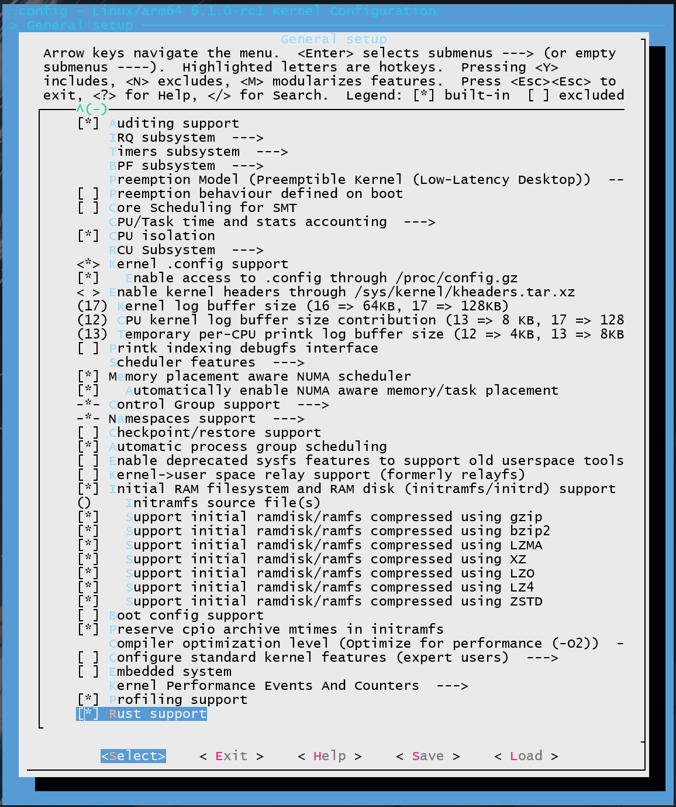
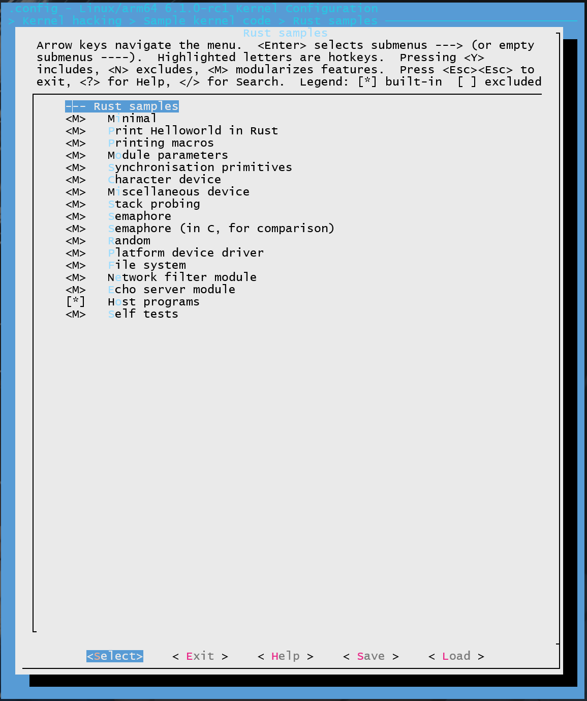
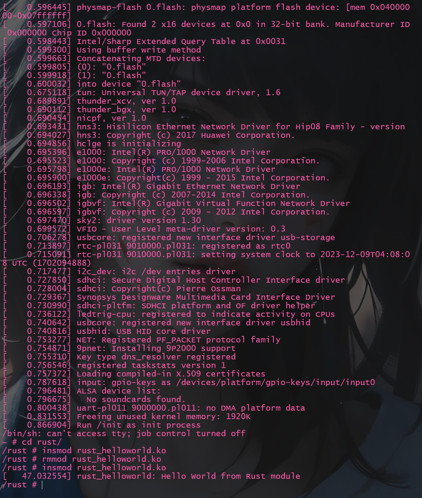

[第二次练习文档](../exercise2.md)
# 1 修改内核源码
此过程与第一次练习区别不大, 主要区别就在于添加了驱动模块

## 1.1 添加`rust_helloworld.rs`源代码
```bash
$ cd linux-rust-e1000
$ cat > ./samples/rust/rust_helloworld.rs
// SPDX-License-Identifier: GPL-2.0
//! Rust minimal sample.
      
use kernel::prelude::*;
      
module! {
  type: RustHelloWorld,
  name: "rust_helloworld",
  author: "whocare",
  description: "hello world module in rust",
  license: "GPL",
}
      
struct RustHelloWorld {}
      
impl kernel::Module for RustHelloWorld {
  fn init(_name: &'static CStr, _module: &'static ThisModule) -> Result<Self> {
      pr_info!("Hello World from Rust module");
      Ok(RustHelloWorld {})
  }
}
## ctrl D
```
## 1.2 修改`samples/rust/Makefile`
```makefile
# SPDX-License-Identifier: GPL-2.0

obj-$(CONFIG_SAMPLE_RUST_MINIMAL)		+= rust_minimal.o
obj-$(CONFIG_SAMPLE_RUST_PRINT)			+= rust_print.o
obj-$(CONFIG_SAMPLE_RUST_MODULE_PARAMETERS)	+= rust_module_parameters.o
obj-$(CONFIG_SAMPLE_RUST_SYNC)			+= rust_sync.o
obj-$(CONFIG_SAMPLE_RUST_CHRDEV)		+= rust_chrdev.o
obj-$(CONFIG_SAMPLE_RUST_MISCDEV)		+= rust_miscdev.o
obj-$(CONFIG_SAMPLE_RUST_STACK_PROBING)		+= rust_stack_probing.o
obj-$(CONFIG_SAMPLE_RUST_SEMAPHORE)		+= rust_semaphore.o
obj-$(CONFIG_SAMPLE_RUST_SEMAPHORE_C)		+= rust_semaphore_c.o
obj-$(CONFIG_SAMPLE_RUST_RANDOM)		+= rust_random.o
obj-$(CONFIG_SAMPLE_RUST_PLATFORM)		+= rust_platform.o
obj-$(CONFIG_SAMPLE_RUST_NETFILTER)		+= rust_netfilter.o
obj-$(CONFIG_SAMPLE_RUST_ECHO_SERVER)		+= rust_echo_server.o
obj-$(CONFIG_SAMPLE_RUST_FS)			+= rust_fs.o
obj-$(CONFIG_SAMPLE_RUST_SELFTESTS)		+= rust_selftests.o

######################## Add begin ########################
obj-$(CONFIG_SAMPLE_RUST_HELLOWORLD)        += rust_helloworld.o
######################## Add end ########################

subdir-$(CONFIG_SAMPLE_RUST_HOSTPROGS)		+= hostprogs
```
## 1.3 修改`samples/rust/Kconfig`
```kconfig
config SAMPLE_RUST_MINIMAL
tristate "Minimal"
help
    This option builds the Rust minimal module sample.

    To compile this as a module, choose M here:
    the module will be called rust_minimal.

    If unsure, say N.

config SAMPLE_RUST_HELLOWORLD
######################## Add begin ########################
tristate "Print Helloworld in Rust"
help
    This option builds the Rust Helloworld module sample.

    To compile this as a module, choose M here:
    the module will be called rust_helloworld.

    If unsure, say N.

config SAMPLE_RUST_PRINT
######################## Add end ########################
tristate "Printing macros"
help
    This option builds the Rust printing macros sample.

    To compile this as a module, choose M here:
    the module will be called rust_print.

    If unsure, say N.
```
# 2 编译内核
配置编译选项
```bash
$ make ARCH=arm64 LLVM=1 O=build menuconfig
```
1. 添加Rust支持
    路径为:
    ```bash
    General setup
        ---> [*] Rust support
    ```
   
2. 添加`Sample kernel code`
   路径为:
    ```bash
    Kernel hacking
    ---> Sample Kernel code
        ---> Rust samples
                ---> <*>Print Helloworld in Rust (NEW)
    ```
   

3. 编译
    ```bash
    $ cd build && make ARCH=arm64 LLVM=1 -j$(nproc)
    ```

# 3 制作临时根文件系统
[之前的一章练习](./exercise1.md)使用的是下载的`debian`镜像作为`initrd`, 由于要复制我们自己编译的`ko`文件, 因此采用`busybox`制作`initrd`
## 3.1 编译`busybox`
```bash
$ wget https://busybox.net/downloads/busybox-1.36.1.tar.bz2
$ tar -xf busybox-1.36.1.tar.bz2
$ cd busybox-1.36.1
# 配置环境变量
$ export ARCH=arm64
$ export CROSS_COMPILE=aarch64-linux-gnu-
# busybox-1.36.1目录下
$ make menuconfig
# 修改配置，选中如下项目，静态编译
# Settings -> Build Options -> [*] Build static binary (no share libs)
$ make -j$(nproc)
$ make install
```
编译后得到的`_install`目录是一个非常基础的、包含 BusyBox 命令的 Linux 文件系统。可以直接使用这个 _install 目录作为 initramfs（初始内存文件系统）或者作为一个嵌入式系统的根文件系统。
## 3.2 复制编译好的Rust内核模块
`build`目录下`samples/rust`存在我们编译好的以.ko结尾的文件通常是内核模块, 将其复制到`busybox`编译后得到的`_install`目录
```bash
$ mkdir -p ./busybox-1.36.1/_install/rust
$ cp -r ./build/samples/rust/*.ko ./busybox-1.36.1/_install/rust/
```
## 3.3 完善`initrd`
```bash
$ mkdir proc sys dev tmp mnt
$ cat > init
#!/bin/sh

# 挂载一些必要的文件系统
mount -t proc none /proc
mount -t sysfs none /sys
mount -t tmpfs none /tmp
mount -t devtmpfs none /dev

# 停留在控制台
exec /bin/sh
## ctrl D
$ chmod +x init
```

## 3.4 归档
```bash
$ cd busybox-1.36.1/_install
$ find . -print0 | cpio --null -ov --format=newc | gzip -9 > ../initramfs.cpio.gz
```

# 4 启动`qemu`验证
1. 启动
```bash
$ qemu-system-aarch64 -M virt -cpu cortex-a72 -smp 8 -m 128M -kernel ./build/arch/arm64/boot/Image -initrd ./busybox-1.36.1/initramfs.cpio.gz -nographic -append "init=/init console=ttyAMA0"
```
2. 加载模块
需要先`insmod`再`rmmod`再`insmod`才能输出, 原因未知
```bash
$ insmod rust_helloworld.ko
$ rmmod rust_helloworld.ko
$ insmod rust_helloworld.ko
```
输出:

