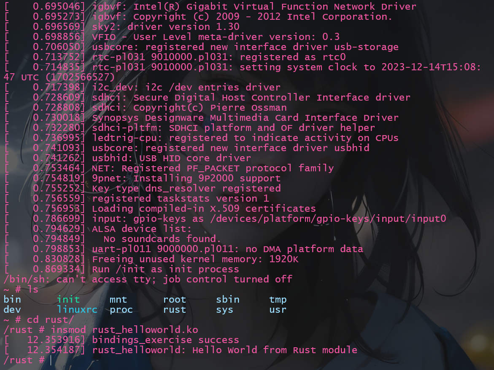

[第三次练习文档](../exercise/exercise3.md)

# 1 创建头文件
在创建`include/linux/bindings_exercise.h`文件如下:
```C
#ifndef OSLEANING_PROJ_3_E3
#define OSLEANING_PROJ_3_E3

#include <linux/printk.h>

void static bindings_exercise() {
    printk("bindings_exercise success\n");
}
#endif
```
使用`printk`完成日志输出

# 2 引用和使用头文件
1. 在`rust/bindings/bindings_helper.h`中添加
```C
#include <linux/uio.h>
// ****************************** exercise 3 ******************************
#include <linux/bindings_exercise.h>
// ****************************** exercise 3 ******************************
#include <uapi/linux/android/binder.h>
```
2. 在`rust/helpers.c`中生成`rust_helper_`为前缀的函数.
```C
#include <linux/clk.h>
// ****************************** exercise 3 ******************************
#include <linux/bindings_exercise.h>
// ****************************** exercise 3 ******************************
#include <linux/errname.h>

...

EXPORT_SYMBOL_GPL(rust_helper_clk_disable_unprepare);

// ****************************** exercise 3 ******************************
void rust_helper_bindings_exercise(void)
{
	bindings_exercise();
}
EXPORT_SYMBOL_GPL(rust_helper_bindings_exercise);
// ****************************** exercise 3 ******************************

int rust_helper_clk_prepare_enable(struct clk *clk)
{
	return clk_prepare_enable(clk);
}
```

# 3 在模块中使用
在`exercise2`中创建的`samples/rust/rust_helloworld.rs`中添加新增函数的调用:
```rust
impl kernel::Module for RustHelloWorld {
    fn init(_name: &'static CStr, _module: &'static ThisModule) -> Result<Self> {
        // ****************************** exercise 3 ******************************
        unsafe {
            bindings::bindings_exercise();
        };
        // ****************************** exercise 3 ******************************

        pr_info!("Hello World from Rust module\n");
        Ok(RustHelloWorld {})
    }
}
```

# 4 重新编译并运行
运行结果如下:


